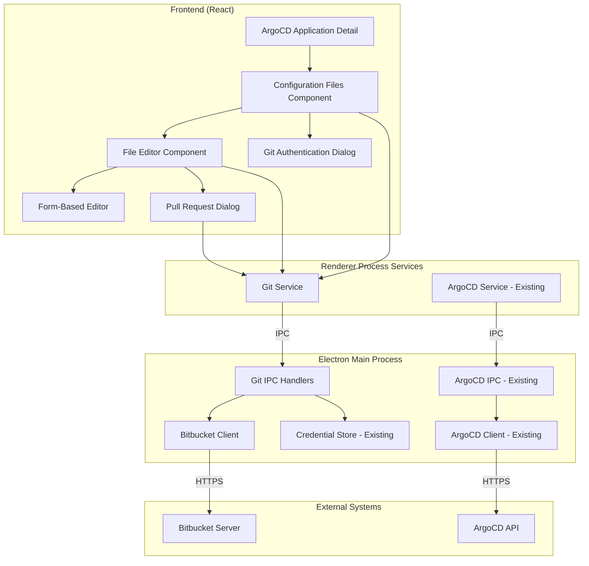

# Design Document: Git Configuration Management

## Overview

This design extends Config Hub's existing ArgoCD integration to enable self-service configuration management through Git. The feature adds file viewing, editing, and Pull Request workflows while building on existing infrastructure including credential management, ArgoCD API integration, and UI components.

### Design Principles

1. **Build on Existing Infrastructure** - Reuse Config Hub's credential management, ArgoCD service layer, and UI patterns
2. **User-Context Operations** - All Git operations use individual user credentials for proper attribution
3. **Path-Level Security** - Respect ArgoCD application path boundaries to prevent unauthorized access
4. **GitOps Workflow** - All changes flow through Pull Requests, never direct commits
5. **Progressive Enhancement** - Add features incrementally without breaking existing functionality

## UI Wireframes

### 1. Application Detail Page with Configuration Files Section

```
┌─────────────────────────────────────────────────────────────────┐
│ Config Hub                                   [User] [Settings]  │
├─────────────────────────────────────────────────────────────────┤
│ ← Back to Applications                                          │
│                                                                 │
│ Application: customer-acme-prod                                 │
│ ┌─────────────────────────────────────────────────────────────┐ │
│ │ Status: ● Healthy    Sync: ✓ Synced                         │ │
│ │ Namespace: acme-prod    Cluster: production                 │ │
│ └─────────────────────────────────────────────────────────────┘ │
│                                                                 │
│ ┌─────────────────────────────────────────────────────────────┐ │
│ │ 📁 Git Source                                               │ │
│ │ Repository: https://bitbucket.example.com/scm/proj/repo.git  │ │
│ │ Path: customers/acme                                         │ │
│ │ Revision: main (abc123f)                                     │ │
│ │ Last Commit: "Update values" by john.doe 2 hours ago         │ │
│ └──────────────────────────────────────────────────────────────┘ │
│                                                                  │
│ ┌─────────────────────────────────────────────────────────────┐ │
│ │ 📄 Configuration Files                          [Refresh]   │ │
│ │                                                             │ │
│ │ ┌───────────────────────────────────────────────────────┐   │ │
│ │ │ 🔐 Git Authentication Required                        │   │ │
│ │ │ To view and edit configuration files, please          │   │ │
│ │ │ authenticate with your Git credentials.               │   │ │
│ │ │                                                       │   │ │
│ │ │                    [Authenticate with Git]            │   │ │
│ │ └───────────────────────────────────────────────────────┘   │ │
│ │                                                             │ │
│ │ OR (when authenticated):                                    │ │
│ │                                                             │ │
│ │ ┌───────────────────────────────────────────────────────┐   │ │
│ │ │ 📄 values.yaml                    1.2 KB   [Edit]    │   │ │
│ │ │    Last modified: 2 hours ago by john.doe             │   │ │
│ │ │    Commit: abc123f "Update values"                    │   │ │
│ │ ├───────────────────────────────────────────────────────┤   │ │
│ │ │ 📄 values.schema.json            3.4 KB   [View]     │   │ │
│ │ │    Last modified: 1 week ago by jane.smith            │   │ │
│ │ ├───────────────────────────────────────────────────────┤   │ │
│ │ │ 📄 secrets.yaml                  0.8 KB   [Edit]     │   │ │
│ │ │    Last modified: 3 days ago by bob.jones             │   │ │
│ │ └───────────────────────────────────────────────────────┘   │ │
│ └─────────────────────────────────────────────────────────────┘ │
│                                                                 │
│ [Sync] [Refresh] [View Logs] [View Events]                      │
└─────────────────────────────────────────────────────────────────┘
```

### 2. Git Authentication Dialog

```
┌─────────────────────────────────────────────────────────────┐
│ Git Authentication                                    [×]   │
├─────────────────────────────────────────────────────────────┤
│                                                             │
│ Authenticate with Bitbucket Server                          │
│ Repository: https://bitbucket.example.com/scm/proj/repo.git │
│                                                             │
│ ┌─────────────────────────────────────────────────────────┐ │
│ │ [Personal Access Token] [OAuth]                         │ │
│ ├─────────────────────────────────────────────────────────┤ │
│ │                                                         │ │
│ │ Username                                                │ │
│ │ ┌───────────────────────────────────────────────────┐   │ │
│ │ │ john.doe                                          │   │ │
│ │ └───────────────────────────────────────────────────┘   │ │
│ │                                                         │ │
│ │ Personal Access Token                                   │ │
│ │ ┌───────────────────────────────────────────────────┐   │ │
│ │ │ ●●●●●●●●●●●●●●●●●●●●●●●●●●●●●●●●●●●●●●●●●●●●●●    │   │ │
│ │ └───────────────────────────────────────────────────┘   │ │
│ │                                                         │ │
│ │ ℹ️ Your credentials are encrypted and stored locally.   │ │
│ │                                                         │ │
│ │ [How to create a token?]                                │ │
│ └─────────────────────────────────────────────────────────┘ │
│                                                             │
│                              [Cancel] [Authenticate]        │
└─────────────────────────────────────────────────────────────┘
```

### 3. File Editor Dialog - YAML View

```
┌─────────────────────────────────────────────────────────────────────┐
│ Edit: values.yaml                                             [×]   │
├─────────────────────────────────────────────────────────────────────┤
│                                                                     │
│ customers/acme/values.yaml                                          │
│ Branch: main (abc123f)                                              │
│                                                                     │
│ ┌─────────────────────────────────────────────────────────────────┐ │
│ │ [YAML View] [Form View]                    [Preview Changes]    │ │
│ ├─────────────────────────────────────────────────────────────────┤ │
│ │  1  # Helm values for ACME customer                             │ │
│ │  2  replicaCount: 3                                             │ │
│ │  3                                                              │ │
│ │  4  image:                                                      │ │
│ │  5    repository: myapp                                         │ │
│ │  6    tag: "1.2.3"                                              │ │
│ │  7    pullPolicy: IfNotPresent                                  │ │
│ │  8                                                              │ │
│ │  9  resources:                                                  │ │
│ │ 10    limits:                                                   │ │
│ │ 11      cpu: 500m                                               │ │
│ │ 12      memory: 512Mi                                           │ │
│ │ 13    requests:                                                 │ │
│ │ 14      cpu: 250m                                               │ │
│ │ 15      memory: 256Mi                                           │ │
│ │ 16                                                              │ │
│ │ 17  ingress:                                                    │ │
│ │ 18    enabled: true                                             │ │
│ │ 19    host: acme.example.com                                    │ │
│ │ 20                                                              │ │
│ │                                                                 │ │
│ └─────────────────────────────────────────────────────────────────┘ │
│                                                                     │
│ ✓ Valid YAML                                                       │
│                                                                     │
│                                    [Cancel] [Create Pull Request]   │
└─────────────────────────────────────────────────────────────────────┘
```

### 4. File Editor Dialog - Form View

```
┌─────────────────────────────────────────────────────────────────────┐
│ Edit: values.yaml                                             [×]   │
├─────────────────────────────────────────────────────────────────────┤
│                                                                     │
│ customers/acme/values.yaml                                          │
│ Branch: main (abc123f)                                              │
│                                                                     │
│ ┌─────────────────────────────────────────────────────────────────┐ │
│ │ [YAML View] [Form View]                    [Preview Changes]    │ │
│ ├─────────────────────────────────────────────────────────────────┤ │
│ │                                                                 │ │
│ │ Application Configuration                                       │ │
│ │                                                                 │ │
│ │ Replica Count                                                   │ │
│ │ ┌──────────┐                                                    │ │
│ │ │    3     │  Number of pod replicas                            │ │
│ │ └──────────┘                                                    │ │
│ │                                                                 │ │
│ │ Image                                                           │ │
│ │ Repository                                                      │ │
│ │ ┌────────────────────────────────────────────────────────────┐  │ │
│ │ │ myapp                                                      │  │ │
│ │ └────────────────────────────────────────────────────────────┘  │ │
│ │ Tag                                                             │ │
│ │ ┌────────────────────────────────────────────────────────────┐  │ │
│ │ │ 1.2.3                                                      │  │ │
│ │ └────────────────────────────────────────────────────────────┘  │ │
│ │ Pull Policy                                                     │ │
│ │ ┌────────────────────────────────────────────────────────────┐  │ │
│ │ │ IfNotPresent                                        ▼      │  │ │
│ │ └────────────────────────────────────────────────────────────┘  │ │
│ │                                                                 │ │
│ │ Resources                                                       │ │
│ │ CPU Limit        Memory Limit                                   │ │
│ │ ┌──────────┐    ┌──────────┐                                    │ │
│ │ │  500m    │    │  512Mi   │                                    │ │
│ │ └──────────┘    └──────────┘                                    │ │
│ │                                                                 │ │
│ └─────────────────────────────────────────────────────────────────┘ │
│                                                                     │
│ ✓ All fields valid                                                  │
│                                                                     │
│                                    [Cancel] [Create Pull Request]   │
└─────────────────────────────────────────────────────────────────────┘
```

### 5. Diff Preview

```
┌─────────────────────────────────────────────────────────────────────┐
│ Preview Changes: values.yaml                                  [×]   │
├─────────────────────────────────────────────────────────────────────┤
│                                                                     │
│ Changes to customers/acme/values.yaml                               │
│                                                                     │
│ ┌─────────────────────────────────────────────────────────────────┐ │
│ │ Current (main)              │ Proposed Changes                  │ │
│ ├─────────────────────────────┼───────────────────────────────────┤ │
│ │  1  # Helm values           │  1  # Helm values                 │ │
│ │  2  replicaCount: 3         │  2  replicaCount: 5               │ │
│ │  3                           │  3                               │ │
│ │  4  image:                   │  4  image:                       │ │
│ │  5    repository: myapp      │  5    repository: myapp          │ │
│ │  6    tag: "1.2.3"           │  6    tag: "1.3.0"               │ │
│ │  7    pullPolicy: IfNotPres  │  7    pullPolicy: IfNotPresent   │ │
│ │  8                           │  8                               │ │
│ │  9  resources:               │  9  resources:                   │ │
│ │ 10    limits:                │ 10    limits:                    │ │
│ │ 11      cpu: 500m            │ 11      cpu: 1000m               │ │
│ │ 12      memory: 512Mi        │ 12      memory: 1Gi              │ │
│ │ 13    requests:              │ 13    requests:                  │ │
│ │ 14      cpu: 250m            │ 14      cpu: 500m                │ │
│ │ 15      memory: 256Mi        │ 15      memory: 512Mi            │ │
│ └─────────────────────────────┴───────────────────────────────────┘ │
│                                                                     │
│ Summary:                                                            │
│ • Increased replica count from 3 to 5                               │
│ • Updated image tag from 1.2.3 to 1.3.0                             │
│ • Increased CPU and memory limits                                   │
│                                                                     │
│                                    [Back] [Create Pull Request]     │
└─────────────────────────────────────────────────────────────────────┘
```

### 6. Pull Request Dialog

```
┌─────────────────────────────────────────────────────────────────────┐
│ Create Pull Request                                           [×]   │
├─────────────────────────────────────────────────────────────────────┤
│                                                                     │
│ Repository: proj/repo                                               │
│ Source: config-hub/acme-values-update-20250510 → Target: main       │
│                                                                     │
│ Title *                                                             │
│ ┌─────────────────────────────────────────────────────────────────┐ │
│ │ Update ACME customer resources and image version                │ │
│ └─────────────────────────────────────────────────────────────────┘ │
│                                                                     │
│ Description                                                         │
│ ┌─────────────────────────────────────────────────────────────────┐ │
│ │ ## Changes                                                      │ │
│ │ - Increased replica count from 3 to 5                           │ │
│ │ - Updated image tag from 1.2.3 to 1.3.0                         │ │
│ │ - Increased CPU limit from 500m to 1000m                        │ │
│ │ - Increased memory limit from 512Mi to 1Gi                      │ │
│ │                                                                 │ │
│ │ ## Reason                                                       │ │
│ │ ACME customer requested higher capacity for increased traffic.  │ │
│ │                                                                 │ │
│ │ ## Affected Applications                                        │ │
│ │ - customer-acme-prod                                            │ │
│ └─────────────────────────────────────────────────────────────────┘ │
│                                                                     │
│ Reviewers (optional)                                                │
│ ┌─────────────────────────────────────────────────────────────────┐ │
│ │ [Search users...]                                               │ │
│ │ ● jane.smith (Platform Team)                                    │ │
│ │ ● bob.jones (DevOps Lead)                                       │ │
│ └─────────────────────────────────────────────────────────────────┘ │
│                                                                     │
│ Notifications                                                       │
│ ☑ Send to MS Teams (#platform-changes)                              │
│ ☑ Send to Slack (#deployments)                                      │
│                                                                     │
│ Files Changed: 1                                                     │
│ • customers/acme/values.yaml (+5, -5)                                │
│                                                                      │
│                                    [Cancel] [Create Pull Request]    │
└──────────────────────────────────────────────────────────────────────┘
```

### 7. Pull Request Success

```
┌─────────────────────────────────────────────────────────────────────┐
│ Pull Request Created                                          [×]   │
├─────────────────────────────────────────────────────────────────────┤
│                                                                     │
│                          ✓ Success!                                 │
│                                                                     │
│ Your Pull Request has been created successfully.                    │
│                                                                     │
│ ┌─────────────────────────────────────────────────────────────────┐ │
│ │ PR #42: Update ACME customer resources and image version        │ │
│ │                                                                 │ │
│ │ Status: Open                                                    │ │
│ │ Author: john.doe                                                │ │
│ │ Reviewers: jane.smith, bob.jones                                │ │
│ │ Created: Just now                                               │ │
│ │                                                                 │ │
│ │ [View in Bitbucket →]                                           │ │
│ └─────────────────────────────────────────────────────────────────┘ │
│                                                                     │
│ Notifications sent to:                                              │
│ • MS Teams (#platform-changes)                                      │
│ • Slack (#deployments)                                              │
│                                                                     │
│ Next Steps:                                                         │
│ 1. Reviewers will be notified                                       │
│ 2. Once approved, merge the PR in Bitbucket                         │
│ 3. ArgoCD will automatically sync the changes                       │
│                                                                     │
│                                                      [Close]        │
└─────────────────────────────────────────────────────────────────────┘
```

### 8. Mobile/Responsive View

```
┌───────────────────────────┐
│ ☰  Config Hub     [User] │
├───────────────────────────┤
│ ← Applications            │
│                           │
│ customer-acme-prod        │
│ ● Healthy  ✓ Synced       │
│                           │
│ ▼ Git Source              │
│ bitbucket.../proj/repo    │
│ customers/acme            │
│ main (abc123f)            │
│                           │
│ ▼ Configuration Files     │
│ [Authenticate with Git]   │
│                           │
│ OR (when authenticated):  │
│                           │
│ 📄 values.yaml            │
│    1.2 KB                 │
│    2 hours ago            │
│    [Edit]                 │
│                           │
│ 📄 values.schema.json     │
│    3.4 KB                 │
│    1 week ago             │
│    [View]                 │
│                           │
│ 📄 secrets.yaml           │
│    0.8 KB                 │
│    3 days ago             │
│    [Edit]                 │
│                           │
│ [Sync] [Refresh] [Logs]   │
└───────────────────────────┘
```

## Architecture

### High-Level Component Diagram



**Key Architecture Points:**

1. **All external API calls go through Electron Main Process** - This follows the existing pattern where ArgoCD API calls are made from the main process
2. **Git Service in Renderer** - Similar to ArgoCDService, provides a clean API for React components and handles IPC communication
3. **Bitbucket Client in Main Process** - Similar to ArgoCDClient, handles HTTP requests to Bitbucket Server
4. **Shared Credential Store** - Reuses existing secure credential storage for both ArgoCD and Git credentials
5. **IPC Communication** - All Git operations (file access, PR creation, etc.) use Electron IPC for security and isolation

### Data Flow

1. **File Viewing Flow**
   - User views ArgoCD application detail page
   - Component extracts Git source info (repoURL, path, revision)
   - GitService requests files using user's stored credentials
   - Bitbucket API returns file list and content
   - UI displays files with metadata

2. **File Editing Flow**
   - User clicks edit on a configuration file
   - System checks for corresponding .schema.json file
   - Editor modal opens with YAML view (and optional form view)
   - User makes changes with real-time validation
   - Diff preview shows before/after comparison
   - User submits changes

3. **Pull Request Flow**
   - System creates branch using user's Git credentials
   - Commits changes with user attribution
   - Creates Pull Request via Bitbucket API
   - Sends webhook notifications (if configured)
   - Returns PR link to user

4. **Merge and Sync Flow**
   - Webhook or polling detects PR merge
   - System identifies affected ArgoCD applications
   - Triggers ArgoCD sync using existing service
   - Updates UI with new commit SHA

## Components and Interfaces

### 1. Git Service (`src/services/git-service.ts`)

New renderer-side service following the exact pattern of `argocd-service.ts`. This service:
- Runs in the React renderer process
- Communicates with main process via IPC (`window.electronAPI.git.*`)
- Manages credential IDs (not raw credentials)
- Provides a clean API for React components

```typescript
export class GitService {
  // Check if we're in Electron environment
  private get isElectron(): boolean {
    return typeof window !== 'undefined' && !!window.electronAPI
  }

  // Credential management (identical pattern to ArgoCD service)
  private async ensureCredentials(
    environment: Environment,
    repoUrl: string,
    settings: EnvironmentSettings
  ): Promise<string>

  // File operations (all via IPC)
  async listFiles(
    repoUrl: string,
    path: string,
    branch: string,
    environment: Environment,
    settings: EnvironmentSettings
  ): Promise<GitFile[]> {
    const credentialId = await this.ensureCredentials(environment, repoUrl, settings)
    const result = await window.electronAPI.git.listFiles(credentialId, path, branch)
    if (!result.success) throw new Error(result.error)
    return result.data
  }

  async getFileContent(
    repoUrl: string,
    filePath: string,
    branch: string,
    environment: Environment,
    settings: EnvironmentSettings
  ): Promise<GitFileContent> {
    const credentialId = await this.ensureCredentials(environment, repoUrl, settings)
    const result = await window.electronAPI.git.getFileContent(credentialId, filePath, branch)
    if (!result.success) throw new Error(result.error)
    return result.data
  }

  async getFileSchema(
    repoUrl: string,
    filePath: string,
    branch: string,
    environment: Environment,
    settings: EnvironmentSettings
  ): Promise<JSONSchema | null> {
    // Try to fetch corresponding .schema.json file
    const schemaPath = filePath.replace(/\.yaml$/, '.schema.json')
    try {
      const content = await this.getFileContent(repoUrl, schemaPath, branch, environment, settings)
      return JSON.parse(content.content)
    } catch {
      return null // Schema file doesn't exist
    }
  }

  // Branch and commit operations (all via IPC)
  async createBranch(
    repoUrl: string,
    baseBranch: string,
    newBranchName: string,
    environment: Environment,
    settings: EnvironmentSettings
  ): Promise<GitBranch> {
    const credentialId = await this.ensureCredentials(environment, repoUrl, settings)
    const result = await window.electronAPI.git.createBranch(credentialId, baseBranch, newBranchName)
    if (!result.success) throw new Error(result.error)
    return result.data
  }

  async commitChanges(
    repoUrl: string,
    branch: string,
    changes: FileChange[],
    commitMessage: string,
    environment: Environment,
    settings: EnvironmentSettings
  ): Promise<GitCommit> {
    const credentialId = await this.ensureCredentials(environment, repoUrl, settings)
    const result = await window.electronAPI.git.commitChanges(credentialId, branch, changes, commitMessage)
    if (!result.success) throw new Error(result.error)
    return result.data
  }

  // Pull Request operations (all via IPC)
  async createPullRequest(
    repoUrl: string,
    sourceBranch: string,
    targetBranch: string,
    title: string,
    description: string,
    environment: Environment,
    settings: EnvironmentSettings
  ): Promise<PullRequest> {
    const credentialId = await this.ensureCredentials(environment, repoUrl, settings)
    const result = await window.electronAPI.git.createPullRequest(
      credentialId,
      sourceBranch,
      targetBranch,
      title,
      description
    )
    if (!result.success) throw new Error(result.error)
    return result.data
  }

  async getPullRequest(
    repoUrl: string,
    prId: number,
    environment: Environment,
    settings: EnvironmentSettings
  ): Promise<PullRequest> {
    const credentialId = await this.ensureCredentials(environment, repoUrl, settings)
    const result = await window.electronAPI.git.getPullRequest(credentialId, prId)
    if (!result.success) throw new Error(result.error)
    return result.data
  }

  async mergePullRequest(
    repoUrl: string,
    prId: number,
    environment: Environment,
    settings: EnvironmentSettings
  ): Promise<MergeResult> {
    const credentialId = await this.ensureCredentials(environment, repoUrl, settings)
    const result = await window.electronAPI.git.mergePullRequest(credentialId, prId)
    if (!result.success) throw new Error(result.error)
    return result.data
  }

  // Webhook notifications (via IPC)
  async sendWebhookNotification(
    webhookUrl: string,
    payload: WebhookPayload
  ): Promise<void> {
    const result = await window.electronAPI.git.sendWebhookNotification(webhookUrl, payload)
    if (!result.success) throw new Error(result.error)
  }
}

// Singleton instance
export const gitService = new GitService()
```

### 2. Git IPC Handlers (`electron/ipc-handlers/git-handlers.ts`)

IPC handlers in the Electron main process that receive requests from the renderer and execute Git operations. Follows the exact pattern of `argocd-handlers.ts`.

```typescript
// Register Git IPC handlers
export function registerGitHandlers(ipcMain: IpcMain, credentialManager: CredentialManager) {
  // Store Git credentials
  ipcMain.handle('git:storeCredentials', async (event, config) => {
    try {
      const credentialId = await credentialManager.store({
        type: 'git',
        ...config
      })
      return { success: true, credentialId }
    } catch (error) {
      return { success: false, error: error.message }
    }
  })

  // List files
  ipcMain.handle('git:listFiles', async (event, credentialId, path, branch) => {
    try {
      const credentials = await credentialManager.retrieve(credentialId)
      const client = new BitbucketClient(credentials)
      const files = await client.listFiles(path, branch)
      return { success: true, data: files }
    } catch (error) {
      return { success: false, error: error.message }
    }
  })

  // Get file content
  ipcMain.handle('git:getFileContent', async (event, credentialId, filePath, branch) => {
    try {
      const credentials = await credentialManager.retrieve(credentialId)
      const client = new BitbucketClient(credentials)
      const content = await client.getFileContent(filePath, branch)
      return { success: true, data: content }
    } catch (error) {
      return { success: false, error: error.message }
    }
  })

  // Create branch
  ipcMain.handle('git:createBranch', async (event, credentialId, baseBranch, newBranchName) => {
    try {
      const credentials = await credentialManager.retrieve(credentialId)
      const client = new BitbucketClient(credentials)
      const branch = await client.createBranch(baseBranch, newBranchName)
      return { success: true, data: branch }
    } catch (error) {
      return { success: false, error: error.message }
    }
  })

  // Commit changes
  ipcMain.handle('git:commitChanges', async (event, credentialId, branch, changes, commitMessage) => {
    try {
      const credentials = await credentialManager.retrieve(credentialId)
      const client = new BitbucketClient(credentials)
      const commit = await client.createCommit(branch, changes, commitMessage)
      return { success: true, data: commit }
    } catch (error) {
      return { success: false, error: error.message }
    }
  })

  // Create Pull Request
  ipcMain.handle('git:createPullRequest', async (event, credentialId, sourceBranch, targetBranch, title, description) => {
    try {
      const credentials = await credentialManager.retrieve(credentialId)
      const client = new BitbucketClient(credentials)
      const pr = await client.createPullRequest(sourceBranch, targetBranch, title, description)
      return { success: true, data: pr }
    } catch (error) {
      return { success: false, error: error.message }
    }
  })

  // Get Pull Request
  ipcMain.handle('git:getPullRequest', async (event, credentialId, prId) => {
    try {
      const credentials = await credentialManager.retrieve(credentialId)
      const client = new BitbucketClient(credentials)
      const pr = await client.getPullRequest(prId)
      return { success: true, data: pr }
    } catch (error) {
      return { success: false, error: error.message }
    }
  })

  // Merge Pull Request
  ipcMain.handle('git:mergePullRequest', async (event, credentialId, prId) => {
    try {
      const credentials = await credentialManager.retrieve(credentialId)
      const client = new BitbucketClient(credentials)
      const result = await client.mergePullRequest(prId)
      return { success: true, data: result }
    } catch (error) {
      return { success: false, error: error.message }
    }
  })

  // Send webhook notification
  ipcMain.handle('git:sendWebhookNotification', async (event, webhookUrl, payload) => {
    try {
      await sendWebhook(webhookUrl, payload)
      return { success: true }
    } catch (error) {
      return { success: false, error: error.message }
    }
  })
}
```

### 3. Git Provider Abstraction

To support both Bitbucket Server and Bitbucket Cloud (and future providers), we use an abstract interface:

```typescript
// electron/git-providers/git-provider.interface.ts
export interface GitProvider {
  // Repository operations
  listFiles(path: string, branch: string): Promise<GitFile[]>
  getFileContent(filePath: string, branch: string): Promise<GitFileContent>
  
  // Branch operations
  getBranches(): Promise<GitBranch[]>
  createBranch(baseBranch: string, newBranchName: string): Promise<GitBranch>
  
  // Commit operations
  createCommit(branch: string, changes: FileChange[], message: string): Promise<GitCommit>
  
  // Pull Request operations
  createPullRequest(sourceBranch: string, targetBranch: string, title: string, description: string): Promise<PullRequest>
  getPullRequest(prId: number): Promise<PullRequest>
  mergePullRequest(prId: number): Promise<MergeResult>
}

// Factory to create appropriate provider
export function createGitProvider(config: GitConfig): GitProvider {
  const repoUrl = config.serverUrl.toLowerCase()
  
  if (repoUrl.includes('bitbucket.org')) {
    return new BitbucketCloudClient(config)
  } else {
    // Default to Bitbucket Server
    return new BitbucketServerClient(config)
  }
}
```

### 4. Bitbucket Server Client (`electron/git-providers/bitbucket-server-client.ts`)

**Priority: Phase 1 - Implement First**

HTTP client for Bitbucket Server API running in the Electron main process, similar to `argocd-client.ts`. This client:
- Runs in the Electron main process (not renderer)
- Makes actual HTTP requests to Bitbucket Server
- Uses credentials retrieved from secure storage
- Is instantiated by IPC handlers

```typescript
export class BitbucketServerClient implements GitProvider {
  private client: AxiosInstance
  private projectKey: string
  private repoSlug: string

  constructor(config: BitbucketConfig)

  // Repository operations
  async getRepository(projectKey: string, repoSlug: string): Promise<Repository>
  async listFiles(projectKey: string, repoSlug: string, path: string, at: string): Promise<File[]>
  async getFileContent(projectKey: string, repoSlug: string, path: string, at: string): Promise<string>

  // Branch operations
  async getBranches(projectKey: string, repoSlug: string): Promise<Branch[]>
  async createBranch(projectKey: string, repoSlug: string, name: string, startPoint: string): Promise<Branch>

  // Commit operations
  async getCommits(projectKey: string, repoSlug: string, until: string): Promise<Commit[]>
  async createCommit(projectKey: string, repoSlug: string, branch: string, changes: Change[]): Promise<Commit>

  // Pull Request operations
  async createPullRequest(projectKey: string, repoSlug: string, pr: CreatePRRequest): Promise<PullRequest>
  async getPullRequest(projectKey: string, repoSlug: string, prId: number): Promise<PullRequest>
  async mergePullRequest(projectKey: string, repoSlug: string, prId: number, version: number): Promise<PullRequest>
  async getPullRequestStatus(projectKey: string, repoSlug: string, prId: number): Promise<PRStatus>
}
```

**API Endpoints (Bitbucket Server):**
- Base URL: `https://bitbucket.example.com/rest/api/1.0`
- Files: `/projects/{projectKey}/repos/{repoSlug}/browse/{path}?at={branch}`
- Branches: `/projects/{projectKey}/repos/{repoSlug}/branches`
- Commits: `/projects/{projectKey}/repos/{repoSlug}/commits`
- Pull Requests: `/projects/{projectKey}/repos/{repoSlug}/pull-requests`

### 5. Bitbucket Cloud Client (`electron/git-providers/bitbucket-cloud-client.ts`)

**Priority: Phase 2 - Implement After Server Version**

HTTP client for Bitbucket Cloud API (bitbucket.org). Key differences from Server:
- Different API endpoints and structure
- Uses workspace/repository instead of project/repo
- Different authentication (App passwords vs tokens)
- Different PR format

```typescript
export class BitbucketCloudClient implements GitProvider {
  private client: AxiosInstance
  private workspace: string
  private repoSlug: string

  constructor(config: BitbucketConfig) {
    // Parse workspace and repo from URL
    // https://bitbucket.org/workspace/repo
    const urlParts = new URL(config.serverUrl).pathname.split('/')
    this.workspace = urlParts[1]
    this.repoSlug = urlParts[2]

    this.client = axios.create({
      baseURL: 'https://api.bitbucket.org/2.0',
      headers: {
        'Authorization': `Basic ${Buffer.from(`${config.username}:${config.token}`).toString('base64')}`,
        'Content-Type': 'application/json',
      },
      timeout: 30000,
    })
  }

  // Repository operations
  async listFiles(path: string, branch: string): Promise<GitFile[]> {
    const response = await this.client.get(
      `/repositories/${this.workspace}/${this.repoSlug}/src/${branch}/${path}`
    )
    return this.parseCloudFileList(response.data)
  }

  async getFileContent(filePath: string, branch: string): Promise<GitFileContent> {
    const response = await this.client.get(
      `/repositories/${this.workspace}/${this.repoSlug}/src/${branch}/${filePath}`
    )
    return {
      path: filePath,
      content: response.data,
      encoding: 'utf-8',
      sha: branch,
      size: response.data.length
    }
  }

  // Branch operations
  async getBranches(): Promise<GitBranch[]> {
    const response = await this.client.get(
      `/repositories/${this.workspace}/${this.repoSlug}/refs/branches`
    )
    return this.parseCloudBranches(response.data.values)
  }

  async createBranch(baseBranch: string, newBranchName: string): Promise<GitBranch> {
    // Bitbucket Cloud doesn't have direct branch creation API
    // Need to create via commit
    throw new Error('Branch creation via commit not yet implemented')
  }

  // Commit operations
  async createCommit(branch: string, changes: FileChange[], message: string): Promise<GitCommit> {
    // Use Bitbucket Cloud's file update API
    const formData = new FormData()
    changes.forEach(change => {
      formData.append(change.path, change.content)
    })
    formData.append('message', message)
    formData.append('branch', branch)

    const response = await this.client.post(
      `/repositories/${this.workspace}/${this.repoSlug}/src`,
      formData
    )
    return this.parseCloudCommit(response.data)
  }

  // Pull Request operations
  async createPullRequest(
    sourceBranch: string,
    targetBranch: string,
    title: string,
    description: string
  ): Promise<PullRequest> {
    const response = await this.client.post(
      `/repositories/${this.workspace}/${this.repoSlug}/pullrequests`,
      {
        title,
        description,
        source: {
          branch: { name: sourceBranch }
        },
        destination: {
          branch: { name: targetBranch }
        },
        close_source_branch: false
      }
    )
    return this.parseCloudPullRequest(response.data)
  }

  async getPullRequest(prId: number): Promise<PullRequest> {
    const response = await this.client.get(
      `/repositories/${this.workspace}/${this.repoSlug}/pullrequests/${prId}`
    )
    return this.parseCloudPullRequest(response.data)
  }

  async mergePullRequest(prId: number): Promise<MergeResult> {
    const response = await this.client.post(
      `/repositories/${this.workspace}/${this.repoSlug}/pullrequests/${prId}/merge`
    )
    return {
      success: true,
      commit: this.parseCloudCommit(response.data.merge_commit)
    }
  }

  // Helper methods to convert Cloud API format to our standard format
  private parseCloudFileList(data: any): GitFile[] {
    // Convert Bitbucket Cloud format to GitFile[]
  }

  private parseCloudBranches(data: any): GitBranch[] {
    // Convert Bitbucket Cloud format to GitBranch[]
  }

  private parseCloudCommit(data: any): GitCommit {
    // Convert Bitbucket Cloud format to GitCommit
  }

  private parseCloudPullRequest(data: any): PullRequest {
    // Convert Bitbucket Cloud format to PullRequest
  }
}
```

**API Endpoints (Bitbucket Cloud):**
- Base URL: `https://api.bitbucket.org/2.0`
- Files: `/repositories/{workspace}/{repo_slug}/src/{commit}/{path}`
- Branches: `/repositories/{workspace}/{repo_slug}/refs/branches`
- Commits: `/repositories/{workspace}/{repo_slug}/commits`
- Pull Requests: `/repositories/{workspace}/{repo_slug}/pullrequests`

**Key Differences:**

| Feature | Bitbucket Server | Bitbucket Cloud |
|---------|------------------|-----------------|
| Base URL | Self-hosted | api.bitbucket.org |
| Auth | Bearer token | Basic auth (app password) |
| Project/Workspace | Project key | Workspace |
| API Version | 1.0 | 2.0 |
| Branch Creation | Direct API | Via commit |
| File Upload | Multipart | FormData |
| PR Format | Different structure | Different structure |

### 6. Provider Detection and Configuration

Update environment settings to support provider selection:

```typescript
interface EnvironmentSettings {
  // ... existing settings
  git: {
    enabled: boolean
    provider: 'bitbucket-server' | 'bitbucket-cloud' | 'auto-detect'  // New field
    serverUrl: string
    credentialName?: string
    credentialId?: string
    webhooks?: {
      enabled: boolean
      channels: Array<{
        name: string
        url: string
        events: string[]
      }>
    }
  }
}
```

**Auto-Detection Logic:**
```typescript
function detectGitProvider(serverUrl: string): 'bitbucket-server' | 'bitbucket-cloud' {
  const url = serverUrl.toLowerCase()
  
  if (url.includes('bitbucket.org')) {
    return 'bitbucket-cloud'
  }
  
  // Default to server for self-hosted instances
  return 'bitbucket-server'
}
```

### 4. Preload Script Updates (`electron/preload.ts`)

Add Git API to the preload script to expose IPC methods to the renderer:

```typescript
// Add to existing electronAPI
const electronAPI = {
  // ... existing argocd, vault, etc.
  git: {
    storeCredentials: (config: any) => ipcRenderer.invoke('git:storeCredentials', config),
    listFiles: (credentialId: string, path: string, branch: string) => 
      ipcRenderer.invoke('git:listFiles', credentialId, path, branch),
    getFileContent: (credentialId: string, filePath: string, branch: string) => 
      ipcRenderer.invoke('git:getFileContent', credentialId, filePath, branch),
    createBranch: (credentialId: string, baseBranch: string, newBranchName: string) => 
      ipcRenderer.invoke('git:createBranch', credentialId, baseBranch, newBranchName),
    commitChanges: (credentialId: string, branch: string, changes: any[], commitMessage: string) => 
      ipcRenderer.invoke('git:commitChanges', credentialId, branch, changes, commitMessage),
    createPullRequest: (credentialId: string, sourceBranch: string, targetBranch: string, title: string, description: string) => 
      ipcRenderer.invoke('git:createPullRequest', credentialId, sourceBranch, targetBranch, title, description),
    getPullRequest: (credentialId: string, prId: number) => 
      ipcRenderer.invoke('git:getPullRequest', credentialId, prId),
    mergePullRequest: (credentialId: string, prId: number) => 
      ipcRenderer.invoke('git:mergePullRequest', credentialId, prId),
    sendWebhookNotification: (webhookUrl: string, payload: any) => 
      ipcRenderer.invoke('git:sendWebhookNotification', webhookUrl, payload),
  }
}
```

### 5. Configuration Files Component (`src/components/config-files-section.tsx`)

New component added to the application detail page.

```typescript
interface ConfigFilesSectionProps {
  application: ArgoCDApplication
  environment: Environment
}

export function ConfigFilesSection({ application, environment }: ConfigFilesSectionProps) {
  // Extract Git source info from application
  const gitSource = getApplicationSource(application)
  
  // State management
  const [files, setFiles] = useState<GitFile[]>([])
  const [loading, setLoading] = useState(false)
  const [error, setError] = useState<string | null>(null)
  const [hasGitCredentials, setHasGitCredentials] = useState(false)
  
  // Fetch files from Git repository
  const fetchFiles = async () => {
    // Use gitService.listFiles()
  }
  
  // Render file list with edit buttons
  return (
    <Card>
      <CardHeader>
        <CardTitle>Configuration Files</CardTitle>
      </CardHeader>
      <CardContent>
        {!hasGitCredentials && <GitAuthPrompt />}
        {hasGitCredentials && <FileList files={files} onEdit={handleEdit} />}
      </CardContent>
    </Card>
  )
}
```

### 6. File Editor Component (`src/components/file-editor-dialog.tsx`)

Modal dialog for editing files, with YAML and form views.

```typescript
interface FileEditorDialogProps {
  file: GitFile
  content: string
  schema?: JSONSchema
  onSave: (content: string, commitMessage: string) => Promise<void>
  onCancel: () => void
}

export function FileEditorDialog({ file, content, schema, onSave, onCancel }: FileEditorDialogProps) {
  const [editMode, setEditMode] = useState<'yaml' | 'form'>('yaml')
  const [editedContent, setEditedContent] = useState(content)
  const [validationErrors, setValidationErrors] = useState<string[]>([])
  const [showDiff, setShowDiff] = useState(false)
  
  // YAML editor with syntax highlighting
  const renderYamlEditor = () => {
    // Use Monaco Editor or CodeMirror
  }
  
  // Form editor generated from JSON schema
  const renderFormEditor = () => {
    // Use react-jsonschema-form or similar
  }
  
  // Diff preview
  const renderDiff = () => {
    // Use react-diff-viewer
  }
  
  return (
    <Dialog>
      {schema && <ViewToggle mode={editMode} onChange={setEditMode} />}
      {editMode === 'yaml' ? renderYamlEditor() : renderFormEditor()}
      {showDiff && renderDiff()}
      <DialogFooter>
        <Button onClick={onCancel}>Cancel</Button>
        <Button onClick={() => setShowDiff(true)}>Preview Changes</Button>
        <Button onClick={handleSave}>Create Pull Request</Button>
      </DialogFooter>
    </Dialog>
  )
}
```

### 7. Pull Request Dialog (`src/components/pull-request-dialog.tsx`)

Dialog for creating Pull Requests with metadata.

```typescript
interface PullRequestDialogProps {
  changes: FileChange[]
  onSubmit: (prData: PRData) => Promise<PullRequest>
  onCancel: () => void
}

export function PullRequestDialog({ changes, onSubmit, onCancel }: PullRequestDialogProps) {
  const [title, setTitle] = useState('')
  const [description, setDescription] = useState('')
  const [targetBranch, setTargetBranch] = useState('main')
  const [notifyChannels, setNotifyChannels] = useState<string[]>([])
  
  return (
    <Dialog>
      <DialogHeader>
        <DialogTitle>Create Pull Request</DialogTitle>
      </DialogHeader>
      <DialogContent>
        <Input label="Title" value={title} onChange={setTitle} />
        <Textarea label="Description" value={description} onChange={setDescription} />
        <Select label="Target Branch" value={targetBranch} onChange={setTargetBranch} />
        <MultiSelect label="Notify Channels" value={notifyChannels} onChange={setNotifyChannels} />
        <ChangesSummary changes={changes} />
      </DialogContent>
      <DialogFooter>
        <Button onClick={onCancel}>Cancel</Button>
        <Button onClick={handleSubmit}>Create Pull Request</Button>
      </DialogFooter>
    </Dialog>
  )
}
```

### 8. Git Authentication Dialog (`src/components/git-auth-dialog.tsx`)

Dialog for collecting user Git credentials, following the pattern of ArgoCD credentials.

```typescript
interface GitAuthDialogProps {
  repoUrl: string
  onAuthenticate: (credentials: GitCredentials) => Promise<void>
  onCancel: () => void
}

export function GitAuthDialog({ repoUrl, onAuthenticate, onCancel }: GitAuthDialogProps) {
  const [authMethod, setAuthMethod] = useState<'token' | 'oauth'>('token')
  const [username, setUsername] = useState('')
  const [token, setToken] = useState('')
  
  return (
    <Dialog>
      <DialogHeader>
        <DialogTitle>Git Authentication Required</DialogTitle>
        <DialogDescription>
          Provide your credentials for {repoUrl}
        </DialogDescription>
      </DialogHeader>
      <DialogContent>
        <Tabs value={authMethod} onValueChange={setAuthMethod}>
          <TabsList>
            <TabsTrigger value="token">Personal Access Token</TabsTrigger>
            <TabsTrigger value="oauth">OAuth</TabsTrigger>
          </TabsList>
          <TabsContent value="token">
            <Input label="Username" value={username} onChange={setUsername} />
            <Input label="Token" type="password" value={token} onChange={setToken} />
          </TabsContent>
          <TabsContent value="oauth">
            <Button onClick={handleOAuth}>Authenticate with Bitbucket</Button>
          </TabsContent>
        </Tabs>
      </DialogContent>
      <DialogFooter>
        <Button onClick={onCancel}>Cancel</Button>
        <Button onClick={handleAuthenticate}>Authenticate</Button>
      </DialogFooter>
    </Dialog>
  )
}
```

## Data Models

### Git Types (`src/types/git.ts`)

```typescript
export interface GitFile {
  path: string
  name: string
  type: 'file' | 'directory'
  size: number
  lastModified: string
  lastCommit: {
    sha: string
    author: string
    message: string
    date: string
  }
}

export interface GitFileContent {
  path: string
  content: string
  encoding: 'utf-8' | 'base64'
  sha: string
  size: number
}

export interface GitBranch {
  name: string
  sha: string
  protected: boolean
}

export interface GitCommit {
  sha: string
  author: {
    name: string
    email: string
    date: string
  }
  message: string
  parents: string[]
}

export interface FileChange {
  path: string
  content: string
  previousContent?: string
  action: 'add' | 'modify' | 'delete'
}

export interface PullRequest {
  id: number
  title: string
  description: string
  state: 'OPEN' | 'MERGED' | 'DECLINED' | 'SUPERSEDED'
  author: {
    name: string
    email: string
  }
  sourceBranch: string
  targetBranch: string
  createdDate: string
  updatedDate: string
  reviewers: Reviewer[]
  approvals: number
  url: string
}

export interface Reviewer {
  user: {
    name: string
    email: string
  }
  approved: boolean
  status: 'APPROVED' | 'UNAPPROVED' | 'NEEDS_WORK'
}

export interface MergeResult {
  success: boolean
  commit: GitCommit
  message?: string
}

export interface GitCredentials {
  username: string
  token: string
  repoUrl: string
}

export interface WebhookPayload {
  event: 'pr:created' | 'pr:merged'
  pullRequest: PullRequest
  repository: {
    name: string
    url: string
  }
  author: {
    name: string
    email: string
  }
}
```

### Bitbucket Types (`src/types/bitbucket.ts`)

```typescript
export interface BitbucketConfig {
  serverUrl: string
  username: string
  token: string
}

export interface Repository {
  slug: string
  name: string
  project: {
    key: string
    name: string
  }
  links: {
    clone: Array<{
      href: string
      name: string
    }>
  }
}

export interface Branch {
  id: string
  displayId: string
  type: 'BRANCH' | 'TAG'
  latestCommit: string
  isDefault: boolean
}

export interface Commit {
  id: string
  displayId: string
  author: {
    name: string
    emailAddress: string
  }
  authorTimestamp: number
  message: string
  parents: Array<{ id: string }>
}

export interface Change {
  path: {
    toString: string
  }
  content: string
  executable: boolean
}

export interface CreatePRRequest {
  title: string
  description: string
  state: 'OPEN'
  open: true
  closed: false
  fromRef: {
    id: string
    repository: {
      slug: string
      project: {
        key: string
      }
    }
  }
  toRef: {
    id: string
    repository: {
      slug: string
      project: {
        key: string
      }
    }
  }
  reviewers: Array<{
    user: {
      name: string
    }
  }>
}

export interface PRStatus {
  state: 'OPEN' | 'MERGED' | 'DECLINED' | 'SUPERSEDED'
  participants: Array<{
    user: {
      name: string
      emailAddress: string
    }
    role: 'REVIEWER' | 'PARTICIPANT'
    approved: boolean
    status: 'APPROVED' | 'UNAPPROVED' | 'NEEDS_WORK'
  }>
}
```

## Error Handling

### Error Types

```typescript
export class GitError extends Error {
  constructor(
    message: string,
    public code: GitErrorCode,
    public details?: any
  ) {
    super(message)
    this.name = 'GitError'
  }
}

export enum GitErrorCode {
  AUTHENTICATION_FAILED = 'AUTHENTICATION_FAILED',
  AUTHORIZATION_FAILED = 'AUTHORIZATION_FAILED',
  REPOSITORY_NOT_FOUND = 'REPOSITORY_NOT_FOUND',
  FILE_NOT_FOUND = 'FILE_NOT_FOUND',
  BRANCH_EXISTS = 'BRANCH_EXISTS',
  MERGE_CONFLICT = 'MERGE_CONFLICT',
  NETWORK_ERROR = 'NETWORK_ERROR',
  INVALID_CREDENTIALS = 'INVALID_CREDENTIALS',
  PATH_RESTRICTED = 'PATH_RESTRICTED',
  UNKNOWN_ERROR = 'UNKNOWN_ERROR'
}
```

### Error Handling Strategy

1. **Authentication Errors** - Prompt user to re-authenticate
2. **Authorization Errors** - Display clear message about insufficient permissions
3. **Network Errors** - Provide retry option with exponential backoff
4. **Validation Errors** - Show inline errors in editor
5. **Merge Conflicts** - Display conflict details and resolution guidance

## Testing Strategy

### Unit Tests

#### 1. Git Service Tests (`src/services/git-service.test.ts`)

```typescript
describe('GitService', () => {
  describe('ensureCredentials', () => {
    it('should store new credentials and return credential ID')
    it('should return existing credential ID if already stored')
    it('should throw error if credentials are incomplete')
  })

  describe('listFiles', () => {
    it('should return list of files from repository')
    it('should filter files by path')
    it('should handle empty directories')
    it('should throw error on authentication failure')
  })

  describe('getFileContent', () => {
    it('should return file content with metadata')
    it('should handle UTF-8 encoded files')
    it('should handle base64 encoded files')
    it('should throw error if file not found')
  })

  describe('getFileSchema', () => {
    it('should return schema if .schema.json exists')
    it('should return null if schema does not exist')
    it('should parse JSON schema correctly')
  })

  describe('createBranch', () => {
    it('should create new branch from base branch')
    it('should throw error if branch already exists')
    it('should throw error on insufficient permissions')
  })

  describe('commitChanges', () => {
    it('should commit file changes with message')
    it('should attribute commit to authenticated user')
    it('should handle multiple file changes')
  })

  describe('createPullRequest', () => {
    it('should create PR with correct metadata')
    it('should set user as PR author')
    it('should return PR URL')
    it('should handle PR creation failure')
  })
})
```

#### 2. Bitbucket Client Tests (`electron/bitbucket-client.test.ts`)

```typescript
describe('BitbucketClient', () => {
  describe('constructor', () => {
    it('should initialize with valid config')
    it('should parse repository URL correctly')
    it('should set up axios instance with auth headers')
  })

  describe('listFiles', () => {
    it('should make correct API request')
    it('should parse file list response')
    it('should handle pagination')
    it('should handle API errors')
  })

  describe('getFileContent', () => {
    it('should fetch file content at specific revision')
    it('should handle large files')
    it('should decode content correctly')
  })

  describe('createBranch', () => {
    it('should create branch via API')
    it('should handle branch name conflicts')
  })

  describe('createCommit', () => {
    it('should commit changes to branch')
    it('should format commit request correctly')
    it('should handle commit conflicts')
  })

  describe('createPullRequest', () => {
    it('should create PR with all metadata')
    it('should add reviewers if specified')
    it('should handle PR creation errors')
  })

  describe('mergePullRequest', () => {
    it('should merge PR when approved')
    it('should handle merge conflicts')
    it('should handle insufficient approvals')
  })
})
```

#### 3. Component Tests

**Configuration Files Section Tests (`src/components/config-files-section.test.tsx`)**

```typescript
describe('ConfigFilesSection', () => {
  it('should render loading state initially')
  it('should display auth prompt when no credentials')
  it('should fetch and display files when credentials exist')
  it('should filter YAML and JSON files')
  it('should show file metadata (size, last modified)')
  it('should enable edit button for files with credentials')
  it('should disable edit button without credentials')
  it('should handle file fetch errors gracefully')
  it('should respect path restrictions from ArgoCD app')
})
```

**File Editor Dialog Tests (`src/components/file-editor-dialog.test.tsx`)**

```typescript
describe('FileEditorDialog', () => {
  it('should render YAML editor by default')
  it('should show form toggle when schema exists')
  it('should not show form toggle without schema')
  it('should validate YAML syntax in real-time')
  it('should display validation errors')
  it('should validate against JSON schema')
  it('should synchronize YAML and form views')
  it('should show diff preview before save')
  it('should call onSave with edited content')
  it('should call onCancel when cancelled')
})
```

**Pull Request Dialog Tests (`src/components/pull-request-dialog.test.tsx`)**

```typescript
describe('PullRequestDialog', () => {
  it('should render with default values')
  it('should validate required fields')
  it('should display changes summary')
  it('should allow selecting target branch')
  it('should allow selecting notification channels')
  it('should call onSubmit with PR data')
  it('should handle submission errors')
})
```

**Git Authentication Dialog Tests (`src/components/git-auth-dialog.test.tsx`)**

```typescript
describe('GitAuthDialog', () => {
  it('should render token auth tab by default')
  it('should switch between token and OAuth tabs')
  it('should validate username and token fields')
  it('should call onAuthenticate with credentials')
  it('should handle OAuth flow')
  it('should display authentication errors')
})
```

### Integration Tests

#### 1. End-to-End File Editing Flow (`tests/integration/file-editing.test.ts`)

```typescript
describe('File Editing Flow', () => {
  it('should complete full editing workflow', async () => {
    // 1. Navigate to application detail
    // 2. Expand configuration files section
    // 3. Click edit on values.yaml
    // 4. Make changes in editor
    // 5. Preview diff
    // 6. Create pull request
    // 7. Verify PR created in Bitbucket
  })

  it('should handle form-based editing with schema', async () => {
    // 1. Open file with schema
    // 2. Toggle to form view
    // 3. Edit form fields
    // 4. Switch back to YAML view
    // 5. Verify changes synchronized
    // 6. Create PR
  })
})
```

#### 2. Authentication Flow (`tests/integration/authentication.test.ts`)

```typescript
describe('Git Authentication Flow', () => {
  it('should prompt for credentials on first access', async () => {
    // 1. View application without Git credentials
    // 2. See authentication prompt
    // 3. Provide credentials
    // 4. Verify credentials stored
    // 5. Verify files now accessible
  })

  it('should reuse stored credentials', async () => {
    // 1. Authenticate once
    // 2. Navigate away and back
    // 3. Verify no re-authentication needed
  })

  it('should handle credential expiration', async () => {
    // 1. Use expired credentials
    // 2. Receive auth error
    // 3. Prompt for re-authentication
    // 4. Update credentials
    // 5. Retry operation
  })
})
```

#### 3. Multi-Repository Support (`tests/integration/multi-repo.test.ts`)

```typescript
describe('Multi-Repository Support', () => {
  it('should handle different credentials per repository', async () => {
    // 1. View app from repo A
    // 2. Authenticate with credentials A
    // 3. View app from repo B
    // 4. Authenticate with credentials B
    // 5. Verify both work independently
  })

  it('should isolate failures per repository', async () => {
    // 1. Repo A accessible, Repo B unavailable
    // 2. Verify Repo A operations work
    // 3. Verify Repo B shows error
    // 4. Verify Repo A unaffected
  })
})
```

#### 4. Path Restrictions (`tests/integration/path-restrictions.test.ts`)

```typescript
describe('Path Restrictions', () => {
  it('should only show files within app path', async () => {
    // 1. App configured with path "customers/acme"
    // 2. List files
    // 3. Verify only files under "customers/acme" shown
  })

  it('should prevent editing files outside app path', async () => {
    // 1. Attempt to access file outside path
    // 2. Verify access denied
    // 3. Verify error message displayed
  })

  it('should prevent PR with files outside path', async () => {
    // 1. Attempt to create PR with out-of-path files
    // 2. Verify PR creation fails
    // 3. Verify validation error shown
  })
})
```

### Manual Testing Scenarios

#### 1. Happy Path Testing

**Scenario: Edit Helm values and deploy**
1. Navigate to ArgoCD application detail page
2. Expand "Configuration Files" section
3. Authenticate with Git credentials (if first time)
4. Click "Edit" on values.yaml
5. Modify a configuration value
6. Preview diff to verify changes
7. Click "Create Pull Request"
8. Fill in PR title and description
9. Submit PR
10. Verify PR link opens in Bitbucket
11. Approve and merge PR in Bitbucket
12. Verify ArgoCD auto-syncs
13. Verify new values deployed

**Scenario: Form-based editing with schema**
1. Open values.yaml that has values.schema.json
2. Toggle to "Form View"
3. Edit fields using form inputs
4. Toggle back to "YAML View"
5. Verify changes reflected in YAML
6. Create PR and verify

#### 2. Error Scenario Testing

**Scenario: Invalid credentials**
1. Provide incorrect Git credentials
2. Verify clear error message
3. Retry with correct credentials
4. Verify successful authentication

**Scenario: Network failure**
1. Disconnect network
2. Attempt to list files
3. Verify error message with retry option
4. Reconnect network
5. Click retry
6. Verify files load successfully

**Scenario: Merge conflict**
1. Create PR with changes
2. Manually modify same file in Git
3. Attempt to merge PR
4. Verify conflict detected
5. Verify conflict resolution guidance shown

**Scenario: Path restriction violation**
1. App configured with path "customers/acme"
2. Attempt to access "../customers/other/values.yaml"
3. Verify access denied
4. Verify clear error message

#### 3. Edge Case Testing

**Scenario: Large file handling**
1. Open file > 1MB
2. Verify loading indicator
3. Verify file loads successfully
4. Edit and save
5. Verify performance acceptable

**Scenario: Multiple simultaneous edits**
1. Open editor for file A
2. Open editor for file B (new window/tab)
3. Edit both files
4. Create PRs for both
5. Verify both PRs created correctly

**Scenario: Credential expiration during operation**
1. Start editing file
2. Credentials expire (simulate)
3. Attempt to save
4. Verify re-authentication prompt
5. Provide new credentials
6. Verify save completes

**Scenario: Special characters in file names**
1. Access file with spaces, unicode, special chars
2. Verify file loads correctly
3. Edit and save
4. Verify PR created with correct file path

### Test Coverage Goals

- **Unit Tests**: 80% code coverage minimum
- **Integration Tests**: Cover all critical user flows
- **Component Tests**: 90% coverage for UI components
- **E2E Tests**: Cover happy path and major error scenarios

### Test Data Requirements

1. **Mock Bitbucket Server**
   - Use MSW (Mock Service Worker) for API mocking
   - Mock responses for all Bitbucket endpoints
   - Simulate various error conditions

2. **Test Repositories**
   - Create test Git repositories with known structure
   - Include files with and without schemas
   - Include various file types (YAML, JSON, etc.)

3. **Test Credentials**
   - Use test credentials that don't access real systems
   - Mock credential storage and retrieval

4. **Test ArgoCD Applications**
   - Create mock applications with various configurations
   - Include single-source and multi-source apps
   - Include apps with different path configurations

## Security Considerations

### Credential Storage

- Use Electron's safeStorage API (already implemented)
- Encrypt credentials at rest
- Never log or expose credentials
- Clear credentials on logout

### Path Restrictions

- Validate all file paths against application's configured path
- Reject attempts to access files outside allowed paths
- Log unauthorized access attempts

### Input Validation

- Validate YAML syntax before committing
- Validate against JSON schema if available
- Sanitize commit messages and PR descriptions
- Prevent injection attacks

### API Security

- Use HTTPS for all Git operations
- Validate SSL certificates
- Implement rate limiting
- Handle token expiration gracefully

### Local Git Isolation (Critical Safety Guardrail)

**Problem:** Bitbucket API operations must not interfere with local Git repositories or operations.

**Guardrails:**

1. **No Local Git Commands**
   - Never use `git` CLI commands for file operations
   - All operations go through Bitbucket REST API only
   - No local repository cloning for file viewing/editing

2. **API-Only Operations**
   - File listing: Use Bitbucket API `/browse` endpoint
   - File content: Use Bitbucket API `/raw` endpoint
   - Branch creation: Use Bitbucket API `/branches` endpoint
   - Commits: Use Bitbucket API `/commits` endpoint
   - PRs: Use Bitbucket API `/pull-requests` endpoint

3. **No File System Access**
   - Never write files to local disk for editing
   - All editing happens in-memory in the browser
   - No temporary Git repositories

4. **Stateless Operations**
   - Each operation is independent
   - No persistent Git state
   - No working directory or index

5. **Clear Separation**
   - Bitbucket client only makes HTTP requests
   - No interaction with local `.git` directories
   - No modification of user's local Git config

**Implementation:**
```typescript
// ❌ NEVER DO THIS
await execAsync(`git clone ${repoUrl}`)
await execAsync(`git add ${file}`)
await execAsync(`git commit -m "${message}"`)

// ✅ ALWAYS DO THIS
await bitbucketClient.getFileContent(path, branch)
await bitbucketClient.createCommit(branch, changes, message)
await bitbucketClient.createPullRequest(...)
```

**Benefits:**
- No risk of modifying user's local repositories
- No risk of committing unintended files
- No risk of Git state corruption
- Clean, predictable behavior
- Works even if Git is not installed locally

## Performance Considerations

### Caching Strategy

1. **File Content Cache**
   - Cache file content for 5 minutes
   - Invalidate on branch change
   - Use commit SHA as cache key

2. **Schema Cache**
   - Cache JSON schemas indefinitely
   - Invalidate only on explicit refresh

3. **Repository Metadata Cache**
   - Cache branch list for 1 minute
   - Cache commit history for 5 minutes

### Optimization Techniques

1. **Lazy Loading**
   - Load files only when Configuration Files section is expanded
   - Load file content only when viewing/editing

2. **Debouncing**
   - Debounce validation during editing (300ms)
   - Debounce search/filter operations (500ms)

3. **Pagination**
   - Paginate file lists for large directories
   - Limit commit history to last 50 commits

## Deployment Considerations

### Configuration

Add to environment settings:

```typescript
interface EnvironmentSettings {
  // ... existing settings
  git: {
    enabled: boolean
    serverUrl: string
    credentialName?: string
    credentialId?: string
    webhooks?: {
      enabled: boolean
      channels: Array<{
        name: string
        url: string
        events: string[]
      }>
    }
  }
}
```

### Migration Path

1. **Phase 1: Read-Only**
   - Deploy file viewing capability
   - Test with production data
   - Gather user feedback

2. **Phase 2: Editing**
   - Enable file editing
   - Enable PR creation
   - Monitor for issues

3. **Phase 3: Automation**
   - Enable webhook notifications
   - Enable auto-sync on merge
   - Full feature rollout

### Rollback Plan

- Feature flag to disable Git integration
- Graceful degradation if Git service unavailable
- Preserve existing ArgoCD functionality

## Documentation and Help System

### User Documentation

#### 1. Feature Documentation (`docs/git/GIT_CONFIG_MANAGEMENT.md`)

Comprehensive guide covering:
- Overview of Git configuration management
- Prerequisites and setup
- Step-by-step workflows
- Troubleshooting common issues
- Best practices

**Sections:**
```markdown
# Git Configuration Management

## Overview
- What is Git configuration management?
- How it integrates with ArgoCD
- Benefits of the Pull Request workflow

## Getting Started
- Authenticating with Git
- Viewing configuration files
- Understanding path restrictions

## Editing Configuration Files
- YAML editor basics
- Form-based editing with schemas
- Validation and error handling
- Previewing changes

## Pull Request Workflow
- Creating a Pull Request
- Adding reviewers and notifications
- Reviewing and approving PRs
- Merging and auto-sync

## Troubleshooting
- Authentication issues
- Permission errors
- Merge conflicts
- Network problems

## Best Practices
- Commit message guidelines
- PR description templates
- Review process recommendations
- Security considerations
```

#### 2. Quick Start Guide (`docs/git/QUICK_START_GIT_CONFIG.md`)

Fast-track guide for common tasks:
```markdown
# Quick Start: Git Configuration Management

## 5-Minute Setup
1. Navigate to any ArgoCD application
2. Click "Authenticate with Git" in Configuration Files section
3. Enter your Bitbucket credentials
4. Start editing!

## Common Tasks

### Edit a Helm values file
1. Find values.yaml in Configuration Files
2. Click "Edit"
3. Make changes
4. Click "Create Pull Request"

### Use form-based editing
1. Open a file with a .schema.json
2. Toggle to "Form View"
3. Fill in form fields
4. Submit changes

### Review and merge a PR
1. Click PR link after creation
2. Review changes in Bitbucket
3. Approve and merge
4. Watch ArgoCD auto-sync
```

#### 3. API Documentation (`docs/git/API_REFERENCE.md`)

For developers extending the feature:
```markdown
# Git Service API Reference

## GitService

### Methods

#### listFiles()
Lists files in a repository path.

**Parameters:**
- `repoUrl: string` - Repository URL
- `path: string` - Path within repository
- `branch: string` - Branch name
- `environment: Environment` - Environment context
- `settings: EnvironmentSettings` - Environment settings

**Returns:** `Promise<GitFile[]>`

**Example:**
```typescript
const files = await gitService.listFiles(
  'https://bitbucket.example.com/scm/proj/repo.git',
  'customers/acme',
  'main',
  'production',
  settings
)
```

[... more methods ...]
```

### In-App Help System

#### 1. Help Panel Updates (`src/components/help/git-config-help.tsx`)

Add new help content for Git features:

```typescript
export const gitConfigHelpContent = {
  'git-authentication': {
    title: 'Git Authentication',
    content: `
      Config Hub needs your Git credentials to access configuration files.
      
      **Personal Access Token (Recommended)**
      1. Generate a token in Bitbucket
      2. Grant "Repository Read" and "Repository Write" permissions
      3. Enter your username and token
      
      **OAuth**
      1. Click "Authenticate with Bitbucket"
      2. Authorize Config Hub
      3. Credentials stored securely
      
      Your credentials are encrypted and stored locally.
    `,
    links: [
      { text: 'Bitbucket Token Guide', url: '/help/bitbucket-tokens' },
      { text: 'Security Best Practices', url: '/help/security' }
    ]
  },
  
  'file-editing': {
    title: 'Editing Configuration Files',
    content: `
      Edit configuration files directly in Config Hub.
      
      **YAML Editor**
      - Syntax highlighting
      - Real-time validation
      - Error detection
      
      **Form Editor** (when schema available)
      - User-friendly form fields
      - Automatic validation
      - Synchronized with YAML view
      
      **Diff Preview**
      - See changes before submitting
      - Side-by-side comparison
      - Highlight additions/deletions
    `,
    video: '/help/videos/file-editing-demo.mp4'
  },
  
  'pull-requests': {
    title: 'Pull Request Workflow',
    content: `
      All changes go through Pull Requests for review.
      
      **Creating a PR**
      1. Edit configuration file
      2. Preview changes
      3. Click "Create Pull Request"
      4. Add title and description
      5. Select reviewers (optional)
      6. Submit
      
      **After Creation**
      - PR link opens in Bitbucket
      - Reviewers notified automatically
      - Merge triggers ArgoCD sync
      
      **Best Practices**
      - Write clear commit messages
      - Explain why changes are needed
      - Tag relevant team members
    `,
    links: [
      { text: 'PR Templates', url: '/help/pr-templates' },
      { text: 'Review Guidelines', url: '/help/review-guidelines' }
    ]
  },
  
  'path-restrictions': {
    title: 'Path Restrictions',
    content: `
      Config Hub restricts file access based on ArgoCD application configuration.
      
      **Why Restrictions?**
      - Security: Prevent unauthorized access
      - Safety: Avoid accidental changes to other apps
      - Compliance: Maintain separation of duties
      
      **How It Works**
      - Each ArgoCD app has a configured Git path
      - You can only view/edit files within that path
      - Attempts to access other paths are blocked
      
      **Example**
      If app is configured with path "customers/acme":
      ✅ Can access: customers/acme/values.yaml
      ❌ Cannot access: customers/other/values.yaml
    `
  },
  
  'troubleshooting': {
    title: 'Troubleshooting',
    content: `
      Common issues and solutions.
      
      **Authentication Failed**
      - Verify credentials are correct
      - Check token hasn't expired
      - Ensure token has required permissions
      
      **Permission Denied**
      - Verify you have write access to repository
      - Check path restrictions
      - Contact repository administrator
      
      **Merge Conflict**
      - Someone else modified the same file
      - Resolve conflict in Bitbucket
      - Or create a new PR with updated changes
      
      **Network Error**
      - Check internet connection
      - Verify Bitbucket server is accessible
      - Try again in a few moments
    `,
    links: [
      { text: 'Full Troubleshooting Guide', url: '/help/troubleshooting' },
      { text: 'Contact Support', url: '/help/support' }
    ]
  }
}
```

#### 2. Contextual Help Tooltips

Add help icons with tooltips throughout the UI:

```typescript
// In Configuration Files Section
<Tooltip content="Files are restricted to the path configured in the ArgoCD application">
  <HelpCircle className="h-4 w-4 text-muted-foreground" />
</Tooltip>

// In File Editor
<Tooltip content="Toggle between YAML and form-based editing. Changes are synchronized.">
  <HelpCircle className="h-4 w-4 text-muted-foreground" />
</Tooltip>

// In PR Dialog
<Tooltip content="Notifications will be sent to configured webhook channels (Teams, Slack, etc.)">
  <HelpCircle className="h-4 w-4 text-muted-foreground" />
</Tooltip>
```

#### 3. Interactive Tutorials

Add guided walkthroughs for first-time users:

```typescript
// Using a library like react-joyride
export const gitConfigTutorial = {
  steps: [
    {
      target: '.config-files-section',
      content: 'This section shows configuration files from your Git repository.',
      placement: 'bottom'
    },
    {
      target: '.git-auth-button',
      content: 'Click here to authenticate with your Git credentials.',
      placement: 'right'
    },
    {
      target: '.file-list',
      content: 'Browse and edit configuration files. Only files within the app\'s path are shown.',
      placement: 'top'
    },
    {
      target: '.edit-button',
      content: 'Click Edit to modify a file. Changes will create a Pull Request.',
      placement: 'left'
    }
  ]
}
```

### Knowledge Base Articles

#### 1. How-To Guides

Create articles in the help system:

- **How to authenticate with Bitbucket**
- **How to edit Helm values**
- **How to use form-based editing**
- **How to create a Pull Request**
- **How to resolve merge conflicts**
- **How to configure webhook notifications**

#### 2. Concept Explanations

- **Understanding GitOps workflow**
- **Why Pull Requests matter**
- **Path-based security model**
- **JSON Schema validation**
- **ArgoCD sync integration**

#### 3. Reference Materials

- **Supported file types**
- **JSON Schema format**
- **Bitbucket API permissions**
- **Webhook payload format**
- **Error code reference**

### Video Tutorials

Create short video demonstrations:

1. **Getting Started (2 min)**
   - Overview of Git configuration management
   - Authentication process
   - First file edit

2. **Editing Workflows (3 min)**
   - YAML editor features
   - Form-based editing
   - Diff preview

3. **Pull Request Process (3 min)**
   - Creating a PR
   - Review and approval
   - Merge and sync

4. **Troubleshooting (2 min)**
   - Common errors
   - How to resolve them
   - Where to get help

### Release Notes

Document the feature in release notes:

```markdown
## Version X.Y.Z - Git Configuration Management

### New Features

**Git-Based Configuration Editing**
- View configuration files directly from Git repositories
- Edit files with syntax highlighting and validation
- Form-based editing for files with JSON schemas
- Create Pull Requests for all changes
- Automatic ArgoCD sync after PR merge

**Security & Compliance**
- User-context Git operations for proper attribution
- Path-level access restrictions
- Encrypted credential storage
- Full audit trail of changes

### Getting Started

1. Navigate to any ArgoCD application
2. Authenticate with your Git credentials
3. Start editing configuration files
4. Changes create Pull Requests automatically

See the [Git Configuration Management Guide](docs/git/GIT_CONFIG_MANAGEMENT.md) for details.

### Breaking Changes

None - this is a new feature that extends existing functionality.

### Known Issues

- Large files (>5MB) may take longer to load
- OAuth authentication requires Bitbucket Server 7.0+

### Feedback

We'd love to hear your feedback! Please report issues or suggestions in [GitHub Issues](https://github.com/your-org/config-hub/issues).
```

### Documentation Maintenance

**Update Existing Docs:**
1. **Main README.md** - Add Git configuration management to features list
2. **ARGOCD_INTEGRATION.md** - Document how Git features integrate with ArgoCD
3. **SECURITY.md** - Add Git credential security information
4. **docs/deployment/QUICK_DEPLOY.md** - Include Git setup in deployment guide

**New Documentation Files:**
1. `docs/git/GIT_CONFIG_MANAGEMENT.md` - Main feature documentation
2. `docs/git/QUICK_START_GIT_CONFIG.md` - Quick start guide
3. `docs/git/API_REFERENCE.md` - Developer API reference
4. `docs/git/TROUBLESHOOTING_GIT.md` - Troubleshooting guide
5. `docs/git/BITBUCKET_SETUP.md` - Bitbucket server setup guide

**Help System Updates:**
1. Add Git section to help navigation
2. Create help articles for each major feature
3. Add contextual help throughout UI
4. Create interactive tutorials
5. Record video demonstrations

## Implementation Phases

### Phase 1: Bitbucket Server Support (Priority)
**Goal:** Full Git configuration management with Bitbucket Server

**Deliverables:**
- Bitbucket Server client implementation
- Git service with IPC communication
- Configuration files viewing
- File editing (YAML and form-based)
- Pull Request creation and management
- User authentication and credential storage
- Path-level security
- Basic documentation

**Timeline:** 4-6 weeks

### Phase 2: Bitbucket Cloud Support
**Goal:** Extend support to Bitbucket Cloud (bitbucket.org)

**Deliverables:**
- Bitbucket Cloud client implementation
- Provider auto-detection
- Cloud-specific authentication (app passwords)
- API format conversion
- Updated documentation

**Timeline:** 2-3 weeks

### Phase 3: Enhanced Features
**Goal:** Advanced editing and workflow capabilities

**Deliverables:**
- Multi-file editing in single PR
- Template-based configuration generation
- Draft PRs
- PR templates
- Bulk operations across applications

**Timeline:** 3-4 weeks

## Future Enhancements

### Additional Git Providers
- **GitHub Enterprise** - Support GitHub's API
- **GitLab** - Support GitLab's API
- **Azure DevOps** - Support Azure Repos

### Secret Management Integration
- **SOPS** - Edit encrypted secrets with SOPS
- **Sealed Secrets** - Support for Sealed Secrets
- **Vault Integration** - Fetch secrets from Vault for editing

### Advanced Workflow Features
- **Automated Testing** - Run tests on PRs before merge
- **Approval Workflows** - Configurable approval requirements
- **Change Notifications** - Real-time notifications for changes
- **Comments in Config Hub** - View and add PR comments without leaving Config Hub

### Collaboration Features
- **Real-time Collaboration** - Multiple users editing simultaneously
- **Change Tracking** - See who's editing what
- **Conflict Prevention** - Warn before conflicting edits

### AI-Assisted Features
- **Configuration Suggestions** - AI-powered recommendations
- **Error Detection** - Predict issues before deployment
- **Auto-completion** - Smart suggestions while editing
